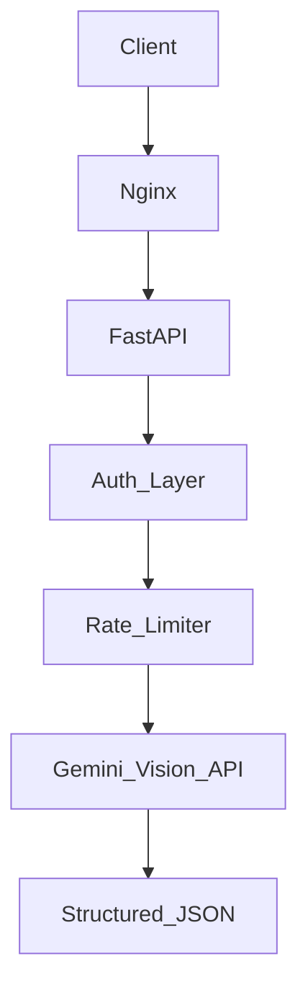

# OCR Extraction Microservice
### GenAI-Powered Document Intelligence 🚀

A high-performance, production-ready microservice for extracting structured data from official documents using Google Gemini Vision AI and FastAPI.

[Documentation](#documentation) • [Installation](#installation) • [Usage](#usage) • [Features](#features) • [Contributing](#contributing)

---

## ✨ Overview

**OCR Extraction** is a robust microservice designed to transform unstructured document images (Passports, Visas, Emirates IDs) into structured, validated JSON data. Built with **FastAPI** and **Google Gemini Vision**, it leverages the power of Multimodal LLMs to handle complex OCR tasks that traditional methods struggle with, such as:

*   **🔍 Multi-Format Support:** Handles JPG, PNG, and PDF files automatically.
*   **🧠 Intelligent Extraction:** Uses context-aware AI to correct orientation and disambiguate characters (e.g., '1' vs 'I').
*   **🛡️ Production Ready:** Includes rate limiting, load balancing, and JWT authentication.
*   **⚡ High Performance:** Async architecture with multiple Gemini API key distribution.

---

## 🌟 Features

### 🎯 Core Capabilities

| Feature              | Description                                                      | Output                                |
| :------------------- | :--------------------------------------------------------------- | :------------------------------------ |
| **🛂 Passport OCR**   | Extracts full details including MRZ from global passports.       | Structured JSON with validated dates. |
| **💳 ID Card OCR**    | specialized extraction for Emirates IDs and standard ID cards.   | Name, ID Number, Expiry, Nationality. |
| **📄 PDF Processing** | Auto-converts PDF documents to high-res images for analysis.     | Seamless handling of multi-page PDFs. |
| **🛡️ MRZ Logic**      | Custom logic to parse and validate Machine Readable Zones (MRZ). | Cleaned, pattern-validated strings.   |

### 🚀 Performance & Security

*   **⚡ Async Architecture:** Built on FastAPI for high-concurrency performance.
*   **🔄 Load Balancing:** Round-robin distribution across multiple Google Gemini API keys to handle rate limits.
*   **🛑 Rate Limiting:** Integrated `SlowAPI` to prevent abuse (default: 5 req/min per IP).
*   **🔒 Security:** JWT Authentication middleware and Nginx reverse proxy configurations.
*   **🐳 Containerized:** Full Docker and Docker Compose support for easy deployment.

---

## 🏗️ Architecture



```text
┌─────────────────────────────────────────────────────────────┐
│                       Client / User                         │
│  POST /extract_passport_details                             │
│  Authorization: Bearer <token>                              │
└──────────────────────────┬──────────────────────────────────┘
                           │
                           ▼
┌─────────────────────────────────────────────────────────────┐
│                   Nginx Reverse Proxy                       │
│  • Entry Point (Port 8000)                                  │
│  • File Size Validation (<200MB)                            │
│  • Load Balancing (Least Conn)                              │
└──────────────────────────┬──────────────────────────────────┘
                           │
                           ▼
┌─────────────────────────────────────────────────────────────┐
│                   FastAPI Application                       │
│  ┌──────────────────────┬────────────────────────────────┐  │
│  │  Middleware          │  Core Logic                    │  │
│  │  • SlowAPI (Limit)   │  • File Validation (PIL/Fitz)  │  │
│  │  • JWT Auth          │  • Model Pool Management       │  │
│  └──────────┬───────────┴────────────────┬───────────────┘  │
│             │                            │                  │
│             ▼                            ▼                  │
│  ┌───────────────────────────────────────────────────┐      │
│  │          Google Gemini Vision API                 │      │
│  │  • Multi-modal LLM Processing                     │      │
│  │  • Context-aware OCR & Extraction                 │      │
│  └───────────────────────────────────────────────────┘      │
└─────────────────────────────────────────────────────────────┘
```

---

## ⚙️ Installation

### Prerequisites

*   🐍 **Python 3.9** or higher
*   🔑 **Google Gemini API Key(s)**
*   🐳 **Docker** (Optional, for containerized run)

### Quick Start (Local)

1.  **Clone the repository**
    ```bash
    git clone https://github.com/Venumurala91/OCR_Extraction.git
    cd OCR_Extraction
    ```

2.  **Create virtual environment**
    ```bash
    python -m venv venv
    # Windows
    venv\Scripts\activate
    # Linux/Mac
    source venv/bin/activate
    ```

3.  **Install dependencies**
    ```bash
    pip install -r requirements.txt
    ```

4.  **Configure Environment**
    Create a `.env` file in the root directory:
    ```env
    SECRET_TOKEN=your_secret_auth_token
    GOOGLE_API_KEY=your_gemini_api_key
    # Add multiple keys if available for load balancing
    GOOGLE_API_KEY_2=your_second_key
    ```

5.  **Run the application**
    ```bash
    python fastapi_app.py
    ```
    Visit documentation at `http://localhost:8000/docs`

### 🐳 Docker Deployment

1.  **Build the image**
    ```bash
    docker-compose build
    ```

2.  **Run containers**
    ```bash
    docker-compose up -d
    ```

3.  **Access API**
    The API will be available at `http://localhost:8000`.

---

## 🚀 Usage

### REST API Workflow

1.  **Authentication:** Obtain your `SECRET_TOKEN` from the admin or `.env` file.
2.  **Make a Request:** Send a POST request with the image file.

### Example Code (Python)

```python
import requests

url = "http://localhost:8000/extract_passport_details"
headers = {
    "Authorization": "your_secret_token"
}
files = {
    "image": open("path/to/passport.jpg", "rb")
}

response = requests.post(url, headers=headers, files=files)
print(response.json())
```

### Supported Endpoints

| Endpoint                       | Method | Description                            |
| :----------------------------- | :----- | :------------------------------------- |
| `/extract_passport_details`    | `POST` | Extract data from Passport images/PDFs |
| `/extract_visa_details`        | `POST` | Extract data from Visa documents       |
| `/extract_emirates_id_details` | `POST` | Extract data from Emirates ID cards    |
| `/health`                      | `GET`  | Server health check status             |

---

## 📦 Project Structure

```text
OCR_Extraction/
├── 📄 fastapi_app.py           # Main application entry point & routes
├── ⚙️  api_functions.py         # Core logic, Gemini interaction, & Validation
├── 🐳 Dockerfile               # Docker build configuration
├── 🐳 docker-compose.yml       # Container orchestration
├── 🔧 nginx.conf               # Nginx reverse proxy configuration
├── 📋 requirements.txt         # Python dependencies
├── 📚 README.md                # Project documentation
└── 🔐 .env                     # Environment variables (GitIgnored)
```

---

## 🐛 Troubleshooting

### Common Issues

| Issue                     | Solution                           | 🔧                                          |
| :------------------------ | :--------------------------------- | :----------------------------------------- |
| **401 Unauthorized**      | Check your `Authorization` header. | ensure it matches `SECRET_TOKEN`.          |
| **429 Too Many Requests** | Rate limit exceeded.               | Wait 1 minute or increase limit in config. |
| **Invalid Image Format**  | Unsupported file type.             | Use `.jpg`, `.png`, or `.pdf`.             |
| **Empty Response**        | Poor image quality.                | Ensure image is clear and not blurry.      |

### Debug Mode

To see detailed logs, ensure your environment is not suppressing output. The application uses standard Python logging.

---

## 🎓 Technology Stack

*   **Framework:** FastAPI
*   **AI Model:** Google Gemini 1.5 Flash / Pro
*   **Image Processing:** Pillow (PIL), PyMuPDF (Fitz)
*   **Server:** Uvicorn
*   **Proxy:** Nginx
*   **Containerization:** Docker

---

## 🔒 License

This project is licensed under the MIT License - see the LICENSE file for details.

---

## 🙏 Acknowledgments

*   **Google DeepMind** for the Gemini Vision API.
*   **Tiangolo** for the amazing FastAPI framework.
